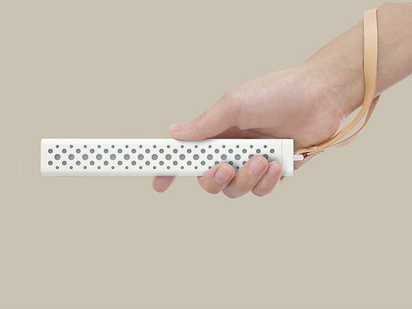

# L-Stick 简介

一次偶然的机会在kickstarter上看到一款智能灯棒**M·Stick**

感觉挺有意思想买一个，马上在亚马逊和淘宝上看了一下，发现这小东西竟然要400块RMB，然后就没有买。

又是一次偶然看到一款蓝牙SOC芯片(nRF52832)这个芯片简直太强大了，发现用这个芯片做那个智能灯棒M·Stick非常适合。然后开始自己做一个类似M·Stick的智能灯棒，姑且命名为 **L-Stick**

**L-Stick**是一个软硬件完全开源的小项目，托管在[https://github.com/codenocold/L-Stick](https://github.com/codenocold/L-Stick)上，本文档会尽量详细的描述开发过程，方便大家快速入门，来一起完善这个小项目，毕竟一个人的力量是有限的。

**L-Stick**的PCB正反面

**L-Stick**硬件电路主要有以下部分：

- 锂电池充放电保护电路

- 锂电池充电电路

- 按键（开关机&交互）

- LDO稳压（RT9193）

- nRF52832

- 16颗RGB灯（WS2812B）

- 三轴加速计（LIS3DH）

基于以上硬件电路的支持再配合相应的软件**L-Stick**除了能实现**M·Stick**所具有的功能外，还可以自由发挥你的想象做很多有意思的应用。比如使用NORDIC推出的蓝牙MESH组网让多个**L-Stick**组成网络做一些联动的灯光效果或把它作为智能家居中的蓝牙智能灯。

开发流程：

- 基本模块的驱动代码
  - 基于**J-Link**的调试信息输出
  - 充电检测、电池电压检测、电源锁定
  - 按键长按开关机&按键单击、双击、三击……
  - RGB灯的驱动
  - 三轴加速计的驱动
- 初步模仿**M·Stick**的几个基本功能
- 低功耗蓝牙通讯应用开发
- 低功耗蓝牙MESH组网应用开发
