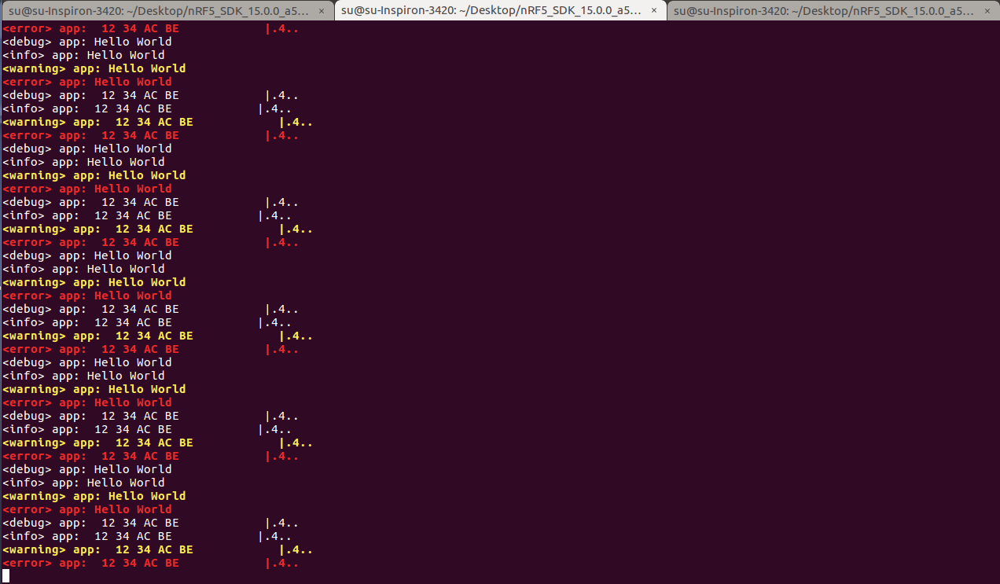
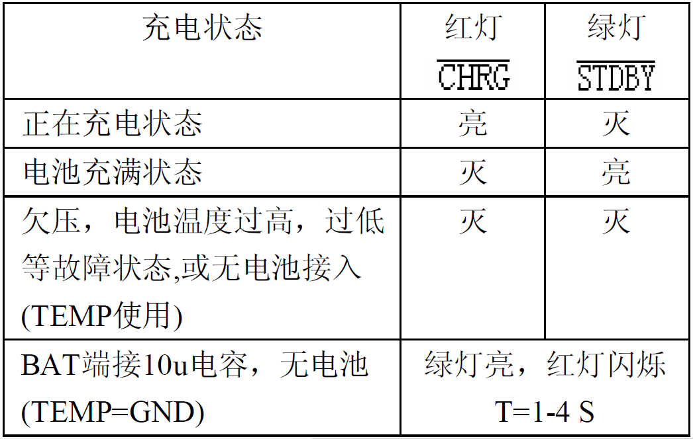
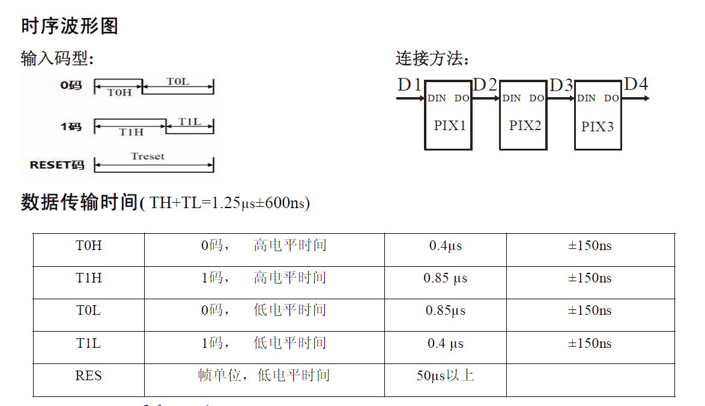

# 基本模块的驱动

## 1 基于J-Link的调试信息输出

### J-Link RTT 简介

通过RTT可以从目标微控制器输出信息以非常高的速度向应用程序发送输入而不影响目标微控制器的实时性。

SEGGER RTT可与任何J-Link型号和任何支持的目标处理器一起使用允许后台内存访问，即Cortex-M和RX目标。

RTT支持两个方向的多个通道，向主机上传数据和由主机发送数据到从机，它可以用于不同的目的，为用户提供最大可能的自由。


### SDK中的Logger module介绍

Logger module是NORDIC提供的一个日志输出的库，主要特性如下：

- 四个打印输出级别 ERROR, WARNING, INFO, DEBUG可以对打印输出进行过滤
- 格式化字符串输出（类似printf）
- 用于转储数据的专用宏（比如 16进制数据的打印输出或存储）
- 可配置的全局打印输出级别
- 可配置的单个模块的独立打印输出级别
- 可对单个模块或全局的打印输出开关控制
- 可对每条打印输出显示时间戳
- 可以设置单个模块或不同打印级别的输出显示的颜色
- 可以对打印输出添加不同的前缀
- 打印输出延迟处理机制，等到空闲时再进行打印输出
- 日志机制实现和后端输出方法解耦和处理
- 支持多种后端输出方法 RTT，UART
- 基于模块和实例的可选动态（运行时）过滤

Logger module 提供了两种打印输出机制：

- 即时输出
- 空闲输出

**即时输出模式**下当调用打印输出函数时，会马上对输出信息进行处理并交给后端所选输出方式进行输出，虽然后端输出可以对要输出的数据进行缓冲，但是一旦后端执行返回后又可以马上执行前端的打印输出调用，这种处理方式是简单粗暴的不是最优的，还会影响芯片性能，尤其是在中断上下文中使用打印输出的情况下。这种操作不是线程安全的，可能会导致打印输出的信息不对。

**空闲输出模式**下当调用打印输出函数时，指向要打印输出信息的指针会被存储到一个内部缓冲区中，并不会执行具体的输出。当用户认为现在芯片为空闲状态时可以调用相应的处理函数触发真正的打印输出。

使用空闲输出模式有以下几点限制：

- 格式化输出的变量个数不能超过6个

- 所有的打印输出变量被存储uint32_t类型

- 因为调用打印输出时会把要输出信息的指针存储到缓冲区，所以要输出信息应该是静态的，要不然有可能造成指针指向无效的数据。但是logger module提供了一种机制去克服这个缺点

  例如下边的代码，使用临时变量作为打印输出的信息，是存在问题的

  ```c
  void foo(void)
  { 
      char string_on_stack[] = "stack";
      //WRONG! by the time the log is processed, variable content will be invalid
      NRF_LOG_INFO("%s",string_on_stack);
  }
  ```

  反之，使用下边的打印输出代码才是正确的

  ```c
  void foo(void)
  { 
      char string_on_stack[] = "stack";
      //nrf_log_push() copies the string into the logger buffer and returns address from the logger buffer
      NRF_LOG_INFO("%s",nrf_log_push(string_on_stack));
  }
  ```

### 工程建立

进入SDK跟目录下新建一个名为L-Stick的文件夹，然后再在L-Stick文件夹内创建一个名为basic的文件夹来存储我们本章中的实验代码，然后再在basic文件夹内创建一个名为RTT的文件夹来存储我们本节的例子。

我们从SDK中的blink的例子复制以下文件到我们本节的工程目录RTT下

- SDK/examples/peripheral/blinky/main.c
- SDK/examples/peripheral/blinky/pca10040/blank/armgcc/blinky_gcc_nrf52.ld
- SDK/examples/peripheral/blinky/pca10040/blank/armgcc/Makefile
- SDK/examples/peripheral/blinky/pca10040/blank/config/sdk_config.h

然后打开Makefile文件稍稍改动以下使我们的RTT工程能够正常编译

1. 第5行`SDK_ROOT := ../../../../../..`修改为`SDK_ROOT := ../../../`
2. 第6行 `PROJ_DIR := ../../..`修改为 `PROJ_DIR := ./`
3. 删除第38行整行

然后打开终端cd到我们本节的RTT目录下就可以执行make命令进行编译了。

#### 修改sdk_config.h

打开我们在 **4.1.3** 建立的工程目录下的sdk_config.h文件将文件中的内容全部删除，替换为下面的内容

```c
#ifndef SDK_CONFIG_H
#define SDK_CONFIG_H


// Logger
#define NRF_LOG_ENABLED 1
#define NRF_LOG_STR_FORMATTER_TIMESTAMP_FORMAT_ENABLED 1
#define NRF_LOG_USES_COLORS 1
#define NRF_LOG_COLOR_DEFAULT 0
#define NRF_LOG_ERROR_COLOR 2
#define NRF_LOG_WARNING_COLOR 4
#define NRF_LOG_DEFAULT_LEVEL 4
#define NRF_LOG_DEFERRED 0
#define NRF_LOG_BUFSIZE 1024
#define NRF_LOG_ALLOW_OVERFLOW 1
#define NRF_LOG_USES_TIMESTAMP 0
#define NRF_LOG_TIMESTAMP_DEFAULT_FREQUENCY 32768
#define NRF_LOG_FILTERS_ENABLED 0
#define NRF_LOG_CLI_CMDS 0
#define NRF_LOG_MSGPOOL_ELEMENT_SIZE 20
#define NRF_LOG_MSGPOOL_ELEMENT_COUNT 8

// Log RTT backend
#define NRF_LOG_BACKEND_RTT_ENABLED 1
#define NRF_LOG_BACKEND_RTT_TEMP_BUFFER_SIZE 64
#define NRF_LOG_BACKEND_RTT_TX_RETRY_DELAY_MS 1
#define NRF_LOG_BACKEND_RTT_TX_RETRY_CNT 3

// SEGGER RTT
#define SEGGER_RTT_CONFIG_BUFFER_SIZE_UP 512
#define SEGGER_RTT_CONFIG_MAX_NUM_UP_BUFFERS 2
#define SEGGER_RTT_CONFIG_BUFFER_SIZE_DOWN 16
#define SEGGER_RTT_CONFIG_MAX_NUM_DOWN_BUFFERS 2
#define SEGGER_RTT_CONFIG_DEFAULT_MODE 0

// Block allocator module
#define NRF_BALLOC_ENABLED 1
#define NRF_BALLOC_CLI_CMDS 0
#define NRF_BALLOC_CONFIG_LOG_ENABLED 0
#define NRF_BALLOC_CONFIG_LOG_LEVEL 3
#define NRF_BALLOC_CONFIG_INITIAL_LOG_LEVEL 3
#define NRF_BALLOC_CONFIG_INFO_COLOR 0
#define NRF_BALLOC_CONFIG_DEBUG_COLOR 0
#define NRF_BALLOC_CONFIG_DEBUG_ENABLED 0
#define NRF_BALLOC_CONFIG_HEAD_GUARD_WORDS 1
#define NRF_BALLOC_CONFIG_TAIL_GUARD_WORDS 1
#define NRF_BALLOC_CONFIG_BASIC_CHECKS_ENABLED 0
#define NRF_BALLOC_CONFIG_DOUBLE_FREE_CHECK_ENABLED 0
#define NRF_BALLOC_CONFIG_DATA_TRASHING_CHECK_ENABLED 0

// fprintf function
#define NRF_FPRINTF_ENABLED 1


#endif
```

以上配置选项都是从开发包中其它例子程序提取出来的，对于每个选项的意义可以在[NORDIC官方文档](http://infocenter.nordicsemi.com/index.jsp?topic=%2Fcom.nordic.infocenter.gs%2Fdita%2Fgs%2Fgs.html)中搜索查看。

#### 修改Makefile

打开Makefile文件，将SRC_FILES 和 INC_FOLDERS变量修改为如下代码

```makefile
# Source files common to all targets
SRC_FILES += \
  $(PROJ_DIR)/main.c \
  $(SDK_ROOT)/modules/nrfx/mdk/gcc_startup_nrf52.S \
  $(SDK_ROOT)/modules/nrfx/mdk/system_nrf52.c \
  $(SDK_ROOT)/components/libraries/atomic/nrf_atomic.c \
  $(SDK_ROOT)/components/libraries/balloc/nrf_balloc.c \
  $(SDK_ROOT)/components/libraries/util/app_util_platform.c \
  $(SDK_ROOT)/components/libraries/experimental_memobj/nrf_memobj.c \
  $(SDK_ROOT)/components/libraries/experimental_log/src/nrf_log_backend_rtt.c \
  $(SDK_ROOT)/components/libraries/experimental_log/src/nrf_log_default_backends.c \
  $(SDK_ROOT)/components/libraries/experimental_log/src/nrf_log_frontend.c \
  $(SDK_ROOT)/components/libraries/experimental_log/src/nrf_log_str_formatter.c \
  $(SDK_ROOT)/components/libraries/experimental_log/src/nrf_log_backend_serial.c \
  $(SDK_ROOT)/external/segger_rtt/SEGGER_RTT.c \
  $(SDK_ROOT)/external/segger_rtt/SEGGER_RTT_Syscalls_GCC.c \
  $(SDK_ROOT)/external/segger_rtt/SEGGER_RTT_printf.c \
  $(SDK_ROOT)/external/fprintf/nrf_fprintf.c \
  $(SDK_ROOT)/external/fprintf/nrf_fprintf_format.c \

# Include folders common to all targets
INC_FOLDERS += \
  $(PROJ_DIR) \
  $(SDK_ROOT)/modules/nrfx \
  $(SDK_ROOT)/modules/nrfx/mdk \
  $(SDK_ROOT)/integration/nrfx \
  $(SDK_ROOT)/components/toolchain/cmsis/include \
  $(SDK_ROOT)/components/drivers_nrf/nrf_soc_nosd \
  $(SDK_ROOT)/components/libraries/atomic \
  $(SDK_ROOT)/components/libraries/balloc \
  $(SDK_ROOT)/components/libraries/delay \
  $(SDK_ROOT)/components/libraries/strerror \
  $(SDK_ROOT)/components/libraries/util \
  $(SDK_ROOT)/components/libraries/experimental_log/src \
  $(SDK_ROOT)/components/libraries/experimental_log \
  $(SDK_ROOT)/components/libraries/experimental_memobj \
  $(SDK_ROOT)/components/libraries/experimental_section_vars \
  $(SDK_ROOT)/external/fprintf \
  $(SDK_ROOT)/external/segger_rtt \
```

这些都是使用我们这个程序要用到的源文件和头文件路径。

#### 修改main.c

打开main.c文件将所有内容删除替换为如下代码

```c
#include "nrf_delay.h"
#include "nrf_log.h"
#include "nrf_log_ctrl.h"
#include "nrf_log_default_backends.h"


/**
 * @brief Function for application main entry.
 */
int main(void)
{
    NRF_LOG_INIT(NULL);
    NRF_LOG_DEFAULT_BACKENDS_INIT();

    uint8_t bytes[] = {0x12, 0x34, 0xAC, 0xBE};

    while (true){
        nrf_delay_ms(1000);

        NRF_LOG_DEBUG("Hello World");
        NRF_LOG_INFO("Hello World");
        NRF_LOG_WARNING("Hello World");
        NRF_LOG_ERROR("Hello World");

        NRF_LOG_HEXDUMP_DEBUG(bytes, sizeof(bytes));
        NRF_LOG_HEXDUMP_INFO(bytes, sizeof(bytes));
        NRF_LOG_HEXDUMP_WARNING(bytes, sizeof(bytes));
        NRF_LOG_HEXDUMP_ERROR(bytes, sizeof(bytes));
    }
}
```

以上代码完成每隔1s打印四种输出级别的 Hello World和字节数组的16进制显示。

完成以上修改后，打开终端cd到本节RTT目录下执行`make`编译出错了，错误信息如下

```
error: implicit declaration of function 'NRF_LOG_INTERNAL_HEXDUMP_' [-Werror=implicit-function-declaration]
```

出现这种错误可能由以下原因造成：

1. 没有把函数所在的c文件生成.o目标文件
2. 在函数所在的c文件中定义了，但是没有在与之相关联的.h文件中声明

经过在源码中查看发现在`SDK/components/libraries/experimental_log/src/nrf_log_internal.h`文件中的第238行

```c
NRF_LOG_INTERNAL_HEXDUMP_(NRF_LOG_SEVERITY_WARNING, NRF_LOG_SEVERITY_WARNING, p_data, len)
```

`NRF_LOG_INTERNAL_HEXDUMP_`只在这一处出现，又对比`NRF_LOG_HEXDUMP_DEBUG`等函数的实现规律，所以判断应该是库中的小缺陷，这也进一步印证了为什么库文件名命名有个前缀experimental。我们只需要将这句改成下面的样子就可以修复这个小问题

```c
NRF_LOG_INTERNAL_HEXDUMP_MODULE(NRF_LOG_SEVERITY_WARNING, NRF_LOG_SEVERITY_WARNING, p_data, len)
```

现在我们再进行`make`就可以正常编译了，然后执行`make flash`烧录到L-Stick就可以了。

我们另外打开两个终端窗口

- 在其中一个执行`JLinkRTTClient`，这个就是我们的JLink RTT输出的终端，我们的打印输出稍后将显示在这个终端中。
- 然后我们在另一个终端中执行以下步骤：
  1. JLinkExe		回车	// 启动JLinkExe工具                           
  2. connect          回车        // 连接L-Stick
  3. 回车                                // 使用默认NRF52832_XXAA作为连接设备
  4. s                       回车       // 选择SWD模式
  5. 回车                                // 速度使用默认 4000 KHz

现在切回到JLink RTT输出的终端就可以看到我们打印输出的信息了



## 2 DWT（数据观察点单元）时间戳

### DWT简介

DWT是Cortex中众多调试组件之一，叫做数据观察点与跟踪单元

它提供的调试功能包括:

1. 它包含了 4 个比较器,可以配置成在发生比较匹配时,执行如下动作:

    - 硬件观察点(产生一个观察点调试事件,并且用它来调用调试模式,包括停机模式和

    调试监视器模式

    - ETM 触发,可以触发 ETM 发出一个数据包,并汇入指令跟踪数据流中
    - 程序计数器(PC)采样器事件触发
    - 数据地址采样器触发
    - 第一个比较器还能用于比较时钟周期计数器(CYCCNT),用于取代对数据地址的比较
2. 作为计数器,DWT 可以对下列项目进行计数:

    - 时钟周期(CYCCNT)
    -  被折叠(Folded)的指令
    - 对加载/存储单元(LSU)的操作
    - 睡眠的时钟周期
    - 每指令周期数(CPI)
    - 中断的额外开销(overhead)
3. 以固定的周期采样 PC 的值
4. 中断事件跟踪

DWT 中有剩余的计数器,它们典型地用于程序代码的“性能速写”(profiling)。通过编程它们,就可以让它们在计数器溢出时发出事件(以跟踪数据包的形式)。最典型地,就是使用 CYCCNT寄存器来测量执行某个任务所花的周期数,这也可以用作时间基准相关的目的(操作系统中统计 CPU使用率可以用到它)。

我们的时间戳实现就是利用DWT作为计数器通过读取CYCCNT寄存器来获取当前时间戳的。

### 工程建立

我们把RTT文件夹复制一份并重命名位DWT作为我们本节的工程文件夹。

#### 修改main.c

打开main.c文件将所有内容删除替换为如下代码

```c
#include "nrf_delay.h"
#include "nrf_log.h"
#include "nrf_log_ctrl.h"
#include "nrf_log_default_backends.h"


/*****************************************************************************
 * @bref    DWT_init
 * @param   none
 * @retval  none
 *****************************************************************************/
void DWT_init(void)
{
    uint32_t val;

    // Enable the trace and debug blocks (DWT is one of them).
    val = CoreDebug->DEMCR;
    CoreDebug->DEMCR = val | CoreDebug_DEMCR_TRCENA_Msk;

    // Make the cycle counter is enabled.
    val = DWT->CTRL;
    DWT->CTRL = val | DWT_CTRL_CYCCNTENA_Msk;
}

/*****************************************************************************
 * @bref    DWT_init
 * @param   none
 * @retval  none
 *****************************************************************************/
static inline uint32_t DWT_get_tick(void){return DWT->CYCCNT;}


/**
 * @brief Function for application main entry.
 */
int main(void)
{
    NRF_LOG_INIT(NULL);
    NRF_LOG_DEFAULT_BACKENDS_INIT();

    // Init DWT
    DWT_init();

    while (true){
        nrf_delay_ms(1000);

        NRF_LOG_DEBUG("CYCCNT: %u", DWT_get_tick());
    }
}

```

程序启动后首先调用DWT_init使能DWT功能，此时DWT的CYCCNT寄存器的值就开始计数了（*计数频率就是我们单片机的运行频率(64MHz)所以每秒CYCCNT的值增加64000000，CYCCNT寄存器是uint32类型的所以我们可以算出来这个计数器会在67秒溢出，从0开始重新计数*）

程序主循环中会每隔一秒会通过RTT打印输出当前CYCCNT的值。

## 3 电池电压检测、充电检测、电源锁定

### 电池电压检测

电池电压检测采用nRF52832的逐次逼近型模数转换器（SAADC）实现，nRF52832的SAADC支持8个通道，每个通道可以分别配置到芯片的AIN0到AIN7引脚，SAADC的特性如下

> - 8/10/12-bit 分辨率, 通过多重采样可以达到14-bit分辨率
> - 电压检测范伟位0到VDD

在官方的SDK中像这类片内外设的硬件抽象层代码都在 `SDK/modules/nrfx/`文件夹内其中又分为**hal**和**drivers**两个层级关系，**hal**层的代码是更直接操作硬件寄存器的**drivers**层是对**hal**层的更加抽象的再次封装，方便大家进行调用。我们在使用某个片内外设时，一般只需要看一下数据手册对这个外设的介绍，看看SDK中的例子，然后再结合这个外设库的文档就可以进行开发了。

### 充电检测

充电检测我们采用通过nRF52832 IO口检测充电芯片TP4056的两个状态IO来进行冲电检测，TP4056数据手册上的状态IO说明如下图



TP4056的CHRG 和 STDBY引脚时高阻态或者拉低状态，所以我们设置nRF52832的IO口为内部上拉输入状态，我们只需要检测三种状态

1. 充电器未接入  CHRG引脚 低电平；STDBY引脚 低电平
2. 正在充电          CHRG引脚 低电平；STDBY引脚 高电平
3. 电池充满          CHRG引脚 高电平；STDBY引脚 低电平

### 电源锁定

电源锁定指的是我们通过按键按下，系统上电开机后我们通过程序控制nRF52832 IO 口拉高来控制供电开关mos管持续导通，这样当我们松开按键的时候系统依然正常供电工作，我们的硬件电路中除了通过nRF52832 IO 口来锁定电源之外还可以通过插入充电器来锁定电源。

### 工程建立

我们把RTT文件夹复制一份并重命名位Power作为我们本节的工程文件夹。

##### 修改sdk_config.h

打开sdk_config.h文件，在其中添加下边的配置宏定义

```c
// nrf_strerror
#define NRF_STRERROR_ENABLED 1

// TIMER periperal driver
#define NRFX_TIMER_ENABLED 1
#define NRFX_TIMER0_ENABLED 1

// SAADC peripheral driver
#define NRFX_SAADC_ENABLED 1

// PPI peripheral allocator
#define NRFX_PPI_ENABLED 1
```

上边配置模块就是我们要用到的模块。

##### 修改Makefile

打开Makefile文件，将SRC_FILES 和 INC_FOLDERS变量修改为如下代码

```makefile
# Source files common to all targets
SRC_FILES += \
  $(PROJ_DIR)/main.c \
  $(SDK_ROOT)/modules/nrfx/mdk/gcc_startup_nrf52.S \
  $(SDK_ROOT)/modules/nrfx/mdk/system_nrf52.c \
  $(SDK_ROOT)/components/libraries/atomic/nrf_atomic.c \
  $(SDK_ROOT)/components/libraries/balloc/nrf_balloc.c \
  $(SDK_ROOT)/components/libraries/util/app_util_platform.c \
  $(SDK_ROOT)/components/libraries/experimental_memobj/nrf_memobj.c \
  $(SDK_ROOT)/components/libraries/experimental_log/src/nrf_log_backend_rtt.c \
  $(SDK_ROOT)/components/libraries/experimental_log/src/nrf_log_default_backends.c \
  $(SDK_ROOT)/components/libraries/experimental_log/src/nrf_log_frontend.c \
  $(SDK_ROOT)/components/libraries/experimental_log/src/nrf_log_str_formatter.c \
  $(SDK_ROOT)/components/libraries/experimental_log/src/nrf_log_backend_serial.c \
  $(SDK_ROOT)/external/segger_rtt/SEGGER_RTT.c \
  $(SDK_ROOT)/external/segger_rtt/SEGGER_RTT_Syscalls_GCC.c \
  $(SDK_ROOT)/external/segger_rtt/SEGGER_RTT_printf.c \
  $(SDK_ROOT)/external/fprintf/nrf_fprintf.c \
  $(SDK_ROOT)/external/fprintf/nrf_fprintf_format.c \
  \
  \
  $(SDK_ROOT)/modules/nrfx/drivers/src/nrfx_ppi.c \
  $(SDK_ROOT)/modules/nrfx/drivers/src/nrfx_saadc.c \
  $(SDK_ROOT)/modules/nrfx/drivers/src/nrfx_timer.c \
  $(SDK_ROOT)/components/libraries/util/app_error.c \
  $(SDK_ROOT)/components/libraries/util/app_error_weak.c \
  $(SDK_ROOT)/components/libraries/strerror/nrf_strerror.c \


# Include folders common to all targets
INC_FOLDERS += \
  $(PROJ_DIR) \
  $(SDK_ROOT)/modules/nrfx \
  $(SDK_ROOT)/modules/nrfx/mdk \
  $(SDK_ROOT)/integration/nrfx \
  $(SDK_ROOT)/components/toolchain/cmsis/include \
  $(SDK_ROOT)/components/drivers_nrf/nrf_soc_nosd \
  $(SDK_ROOT)/components/libraries/atomic \
  $(SDK_ROOT)/components/libraries/balloc \
  $(SDK_ROOT)/components/libraries/delay \
  $(SDK_ROOT)/components/libraries/strerror \
  $(SDK_ROOT)/components/libraries/util \
  $(SDK_ROOT)/components/libraries/experimental_log/src \
  $(SDK_ROOT)/components/libraries/experimental_log \
  $(SDK_ROOT)/components/libraries/experimental_memobj \
  $(SDK_ROOT)/components/libraries/experimental_section_vars \
  $(SDK_ROOT)/external/fprintf \
  $(SDK_ROOT)/external/segger_rtt \
  \
  \
  $(SDK_ROOT)/modules/nrfx/hal \
  $(SDK_ROOT)/modules/nrfx/drivers/include \
```

其实就是添加了本节要用的的源文件和头文件包含路径。

##### 修改main.c

打开main.c文件将代码修改为如下代码

```c
#include "nrf_delay.h"
#include "nrf_log.h"
#include "nrf_log_ctrl.h"
#include "nrf_log_default_backends.h"

#include "nrfx_saadc.h"
#include "nrfx_ppi.h"
#include "nrfx_timer.h"
#include "nrf_gpio.h"


#define POWER_LOCK_PIN  6
#define CHRG_STATE_PIN  3
#define CHRG_STDBY_PIN  4


#define ADC_2_MILIVOLT(ADC)   (ADC*1000/4551)

static const nrfx_timer_t    m_timer = NRFX_TIMER_INSTANCE(0);
static nrf_saadc_value_t     saadc_value;
static nrf_ppi_channel_t     m_ppi_channel;


void timer_handler(nrf_timer_event_t event_type, void * p_context)
{

}

void saadc_callback(nrfx_saadc_evt_t const * p_event)
{
    ret_code_t err_code;
    static uint8_t calib_cnt = 0;

    if(p_event->type == NRFX_SAADC_EVT_DONE){
        if(calib_cnt ++ > 100){
            calib_cnt = 0;
            nrfx_saadc_calibrate_offset();
        }else{
            err_code = nrfx_saadc_buffer_convert(&saadc_value, 1);
            APP_ERROR_CHECK(err_code);

            int16_t adc_val = ADC_2_MILIVOLT(p_event->data.done.p_buffer[0]);
            int16_t bat_val = adc_val * 2;
            NRF_LOG_INFO("ADC milivolt: %d mV, Battery: %d mV", adc_val, bat_val);
        }
    }
}

void saadc_init(void)
{
    ret_code_t err_code;
    nrfx_saadc_config_t saadc_config = {
        .resolution         = NRF_SAADC_RESOLUTION_14BIT,
        .oversample         = NRF_SAADC_OVERSAMPLE_DISABLED,
        .interrupt_priority = APP_IRQ_PRIORITY_LOWEST,
        .low_power_mode     = false,  
    };

    nrf_saadc_channel_config_t channel_config = {
        .resistor_p = NRF_SAADC_RESISTOR_DISABLED,
        .resistor_n = NRF_SAADC_RESISTOR_DISABLED,
        .gain       = NRF_SAADC_GAIN1_6,
        .reference  = NRF_SAADC_REFERENCE_INTERNAL,
        .acq_time   = NRF_SAADC_ACQTIME_40US,
        .mode       = NRF_SAADC_MODE_SINGLE_ENDED,
        .burst      = NRF_SAADC_BURST_DISABLED,
        .pin_p      = (nrf_saadc_input_t)(NRF_SAADC_INPUT_AIN3),
        .pin_n      = NRF_SAADC_INPUT_DISABLED,
    };

    err_code = nrfx_saadc_init(&saadc_config, saadc_callback);
    APP_ERROR_CHECK(err_code);

    err_code = nrfx_saadc_channel_init(3, &channel_config);
    APP_ERROR_CHECK(err_code);

    // Block Read
    nrfx_saadc_sample_convert(3, &saadc_value);
    NRF_LOG_INFO("Start up Block Read milivolt: %d mV", ADC_2_MILIVOLT(saadc_value));
}

void saadc_sampling_event_init(void)
{
    ret_code_t err_code;

    nrfx_timer_config_t timer_cfg = {
        .frequency          = NRF_TIMER_FREQ_500kHz,
        .mode               = NRF_TIMER_MODE_TIMER,
        .bit_width          = NRF_TIMER_BIT_WIDTH_32,
        .interrupt_priority = APP_IRQ_PRIORITY_LOWEST,
        .p_context          = NULL,
    };

    err_code = nrfx_timer_init(&m_timer, &timer_cfg, timer_handler);
    APP_ERROR_CHECK(err_code);

    /* setup m_timer for compare event every 1000ms */
    uint32_t ticks = nrfx_timer_ms_to_ticks(&m_timer, 1000);
    nrfx_timer_extended_compare(&m_timer,
                                   NRF_TIMER_CC_CHANNEL0,
                                   ticks,
                                   NRF_TIMER_SHORT_COMPARE0_CLEAR_MASK,
                                   false);
    nrfx_timer_enable(&m_timer);

    uint32_t timer_compare_event_addr = nrfx_timer_compare_event_address_get(&m_timer, NRF_TIMER_CC_CHANNEL0);
    uint32_t saadc_sample_task_addr   = nrfx_saadc_sample_task_get();

    /* setup ppi channel so that timer compare event is triggering sample task in SAADC */
    err_code = nrfx_ppi_channel_alloc(&m_ppi_channel);
    APP_ERROR_CHECK(err_code);

    err_code = nrfx_ppi_channel_assign(m_ppi_channel,
                                          timer_compare_event_addr,
                                          saadc_sample_task_addr);
    APP_ERROR_CHECK(err_code);
}

void saadc_sampling_event_enable(void)
{
    ret_code_t err_code = nrfx_saadc_buffer_convert(&saadc_value, 1);
    APP_ERROR_CHECK(err_code);

    err_code = nrfx_ppi_channel_enable(m_ppi_channel);
    APP_ERROR_CHECK(err_code);
}


/**
 * @brief Function for application main entry.
 */
int main(void)
{
    NRF_LOG_INIT(NULL);
    NRF_LOG_DEFAULT_BACKENDS_INIT();

    // Config Power lock pin
    nrf_gpio_cfg_output(POWER_LOCK_PIN);

    // Config charging state pin
    nrf_gpio_cfg_input(CHRG_STATE_PIN, NRF_GPIO_PIN_PULLUP);
    nrf_gpio_cfg_input(CHRG_STDBY_PIN, NRF_GPIO_PIN_PULLUP);

    // Config Battery ADC
    saadc_init();
    saadc_sampling_event_init();
    saadc_sampling_event_enable();

    int cnt = 0;

    // Lock Power supply
    nrf_gpio_pin_set(POWER_LOCK_PIN);

    while (true){
        nrf_delay_ms(1000);

        if(nrf_gpio_pin_read(CHRG_STATE_PIN) && nrf_gpio_pin_read(CHRG_STDBY_PIN)){
            // No Charger
        }else if(!nrf_gpio_pin_read(CHRG_STATE_PIN) && nrf_gpio_pin_read(CHRG_STDBY_PIN)){
            // Charging
        }else if(nrf_gpio_pin_read(CHRG_STATE_PIN) && !nrf_gpio_pin_read(CHRG_STDBY_PIN)){
            // Charging Complete
        }

        if(cnt < 20){
            cnt ++;
        }else if(cnt == 20){
            cnt ++;
            // Unlock Power supply
            nrf_gpio_pin_clear(POWER_LOCK_PIN);
        }
    }
}

```

将代码编译烧录到芯片按照前边讲的RTT调试打开JLinkRTTClient和JLinkExe并连接后，在JLinkExe中输入`r`回车复位芯片，输入`g`回车启动程序，（这些命令都是JLinkExe的调试命令，想进一步了解学习的话可以看JLink的文档）就可以完整的看到我们在程序中的输出信息，如下图

代码实现的功能如下

- 初始化logger
- 初始化充电状态检测IO和电源锁定IO
- 初始化saadc
- 初始化定时器并通过PPI连接定时器每1s触发ADC转换，ADC转换完成后会通过RTT打印输出

当ADC转换完成会进入`saadc_callback`函数，在`saadc_callback`函数中会打印输出当前ADC采集的电压值（mV），当每转换100次，进行一次saad校准。

- 锁定电源
- 主循环每间隔1秒检测以下充电状态检测IO状态，并查询现在是否循环了20次，当循环到20次（大概开机后20秒左右）就释放电源锁定IO，如果此时充电器没有插入则断电关机。

## 4 按键长按、单击、双击、三击……

按键检测我们采用在主循环中扫描的方式，我们还需要一个时间戳来让我们能够检测按键是长按、短按、消抖、和连击之间的间隔时间。我们的时间戳不采用上节中的DWT而是采用Systick，相信很多用过stm32的朋友应该很熟悉，这里就不再过多介绍了。

按键***长按***检测逻辑如下：

1. 扫描中如果按键此时按下，记录当前系统计数（ms单位），设置当前按键状态为按下状态
2. 此时按键松开，检测当前系统计数和按下时的系统计数差值是否大于20ms，如果大于20ms则认为这是一次按下事件，把按下事件计数加一，同时记录当前系统计数，如果小于20ms则认为时抖动
3. 轮询当前系统计数，如果距离按键按下时的计数大于1秒则认为长按事件发生，按键扫描函数返回按键长按

按键***单击***检测逻辑如下：

1. 扫描中如果按键此时按下，记录当前系统计数（ms单位），设置当前按键状态为按下状态
2. 此时按键松开，检测当前系统计数和按下时的系统计数差值是否大于20ms，如果大于20ms则认为这是一次按下事件，把按下事件计数加一，同时记录当前系统计数，如果小于20ms则认为时抖动
3. 轮询当前系统计数，如果距离按键松开时的计数大于300ms则认为没有后续连击发生，按键扫描函数返回按键单击发生

按键***双击***检测逻辑如下：

1. 扫描中如果按键此时按下，记录当前系统计数（ms单位），设置当前按键状态为按下状态
2. 此时按键松开，检测当前系统计数和按下时的系统计数差值是否大于20ms，如果大于20ms则认为这是一次按下事件，把按下事件计数加一，同时记录当前系统计数，如果小于20ms则认为时抖动
3. 如果按键在松开后300ms内再次被按下，记录当前系统计数（ms单位），设置当前按键状态为按下状态
4. 此时按键松开，检测当前系统计数和按下时的系统计数差值是否大于20ms，如果大于20ms则认为这是一次按下事件，把按下事件计数加一，同时记录当前系统计数，如果小于20ms则认为时抖动
5. 轮询当前系统计数，如果距离按键松开时的计数大于300ms则认为没有后续连击发生，按键扫描函数返回按键双击发生

按键***三击***检测逻辑和双击的逻辑基本一样，只是按下事件计数再加一而已

### 工程建立

我们把RTT文件夹复制一份并重命名为KEY作为我们本节的工程文件夹。

#### 修改Makefile

打开Makefile文件，将SRC_FILES 和 INC_FOLDERS变量修改为如下代码

``` makefile
# Source files common to all targets
SRC_FILES += \
  $(PROJ_DIR)/main.c \
  $(SDK_ROOT)/modules/nrfx/mdk/gcc_startup_nrf52.S \
  $(SDK_ROOT)/modules/nrfx/mdk/system_nrf52.c \
  $(SDK_ROOT)/components/libraries/atomic/nrf_atomic.c \
  $(SDK_ROOT)/components/libraries/balloc/nrf_balloc.c \
  $(SDK_ROOT)/components/libraries/util/app_util_platform.c \
  $(SDK_ROOT)/components/libraries/experimental_memobj/nrf_memobj.c \
  $(SDK_ROOT)/components/libraries/experimental_log/src/nrf_log_backend_rtt.c \
  $(SDK_ROOT)/components/libraries/experimental_log/src/nrf_log_default_backends.c \
  $(SDK_ROOT)/components/libraries/experimental_log/src/nrf_log_frontend.c \
  $(SDK_ROOT)/components/libraries/experimental_log/src/nrf_log_str_formatter.c \
  $(SDK_ROOT)/components/libraries/experimental_log/src/nrf_log_backend_serial.c \
  $(SDK_ROOT)/external/segger_rtt/SEGGER_RTT.c \
  $(SDK_ROOT)/external/segger_rtt/SEGGER_RTT_Syscalls_GCC.c \
  $(SDK_ROOT)/external/segger_rtt/SEGGER_RTT_printf.c \
  $(SDK_ROOT)/external/fprintf/nrf_fprintf.c \
  $(SDK_ROOT)/external/fprintf/nrf_fprintf_format.c \
  \
  $(PROJ_DIR)/key.c \
  $(PROJ_DIR)/systick.c \


# Include folders common to all targets
INC_FOLDERS += \
  $(PROJ_DIR) \
  $(SDK_ROOT)/modules/nrfx \
  $(SDK_ROOT)/modules/nrfx/mdk \
  $(SDK_ROOT)/integration/nrfx \
  $(SDK_ROOT)/components/toolchain/cmsis/include \
  $(SDK_ROOT)/components/drivers_nrf/nrf_soc_nosd \
  $(SDK_ROOT)/components/libraries/atomic \
  $(SDK_ROOT)/components/libraries/balloc \
  $(SDK_ROOT)/components/libraries/delay \
  $(SDK_ROOT)/components/libraries/strerror \
  $(SDK_ROOT)/components/libraries/util \
  $(SDK_ROOT)/components/libraries/experimental_log/src \
  $(SDK_ROOT)/components/libraries/experimental_log \
  $(SDK_ROOT)/components/libraries/experimental_memobj \
  $(SDK_ROOT)/components/libraries/experimental_section_vars \
  $(SDK_ROOT)/external/fprintf \
  $(SDK_ROOT)/external/segger_rtt \
  \
  $(SDK_ROOT)/modules/nrfx/hal/ \
```

#### 添加文件

在工程目录下添加 systick.h; systick.c; key.h; key.c 四个文件，这四个文件可以直接从我的源码中复制过来。

#### 修改main.c

打开main.c文件将代码修改为如下代码

```c
#include "nrf_delay.h"
#include "nrf_log.h"
#include "nrf_log_ctrl.h"
#include "nrf_log_default_backends.h"

#include "systick.h"
#include "key.h"


/**
 * @brief Function for application main entry.
 */
int main(void)
{
    NRF_LOG_INIT(NULL);
    NRF_LOG_DEFAULT_BACKENDS_INIT();

    SYSTICK_init();
    KEY_init(SYSTICK_get_tick);

    NRF_LOG_DEBUG("KEY START");

    uint8_t keyIndex;

    while (true){
        keyIndex = KEY_scan();
        if(keyIndex){
            NRF_LOG_DEBUG("KEY: %d", keyIndex);
        }
    }
}

```

将程序烧录到芯片后打开RTT调试，首先打印输出KEY START信息，然后我们按按键的时候相应的动作信息也会通过RTT打印输出。

## 5 RGB灯的驱动

### WS2812B灯简介

> WS2812B是一个集控制电路与发光电路于一体的智能外控LED光源。其外型与一个5050LED灯珠相同，每
> 个元件即为一个像素点。像素点内部包含了智能数字接口数据锁存信号整形放大驱动电路，还包含有高精度的内部振荡器和可编程定电流控制部分，有效保证了像素点光的颜色高度一致。
> 数据协议采用单线归零码的通讯方式，像素点在上电复位以后，DIN端接受从控制器传输过来的数据，首先
> 送过来的24bit数据被第一个像素点提取后，送到像素点内部的数据锁存器，剩余的数据经过内部整形处理电路整形放大后通过DO端口开始转发输出给下一个级联的像素点，每经过一个像素点的传输，信号减少24bit。像素点采用自动整形转发技术，使得该像素点的级联个数不受信号传送的限制，仅仅受限信号传输速度要求。
> LED具有低电压驱动，环保节能，亮度高，散射角度大，一致性好，超低功率，超长寿命等优点。将控制电
> 路集成于LED上面，电路变得更加简单，体积小，安装更加简便。

这种灯只要串在一起，只需要使用单片机的一个引脚通过按照手册中的时序图发送高低电平就可以控制每个灯



我们使用nRF52832的PWM片内外设来实现这种时序，通过固定的PWM周期，不同的占空比来模拟 0码和1码。

在官方的SDK中像这类片内外设的硬件抽象层代码都在 `SDK/modules/nrfx/`文件夹内其中又分为**hal**和**drivers**两个层级关系，**hal**层的代码是更直接操作硬件寄存器的**drivers**层是对**hal**层的更加抽象的再次封装，方便大家进行调用。我们在使用某个片内外设时，一般只需要看一下数据手册对这个外设的介绍，看看SDK中的例子，然后再结合这个外设库的文档就可以进行开发了。

### 工程建立

我们把RTT文件夹复制一份并重命名位WS2812B作为我们本节的工程文件夹。

#### 修改sdk_config.h

打开sdk_config.h文件，在其中添加下边的配置宏定义

```c
// PWM peripheral driver
#define NRFX_PWM_ENABLED 1
#define NRFX_PWM0_ENABLED 1
```

使能PWM驱动模块和PWM0

#### 修改Makefile

打开Makefile文件，将SRC_FILES 和 INC_FOLDERS变量修改为如下代码

```makefile
# Source files common to all targets
SRC_FILES += \
  $(PROJ_DIR)/main.c \
  $(SDK_ROOT)/modules/nrfx/mdk/gcc_startup_nrf52.S \
  $(SDK_ROOT)/modules/nrfx/mdk/system_nrf52.c \
  $(SDK_ROOT)/components/libraries/atomic/nrf_atomic.c \
  $(SDK_ROOT)/components/libraries/balloc/nrf_balloc.c \
  $(SDK_ROOT)/components/libraries/util/app_util_platform.c \
  $(SDK_ROOT)/components/libraries/experimental_memobj/nrf_memobj.c \
  $(SDK_ROOT)/components/libraries/experimental_log/src/nrf_log_backend_rtt.c \
  $(SDK_ROOT)/components/libraries/experimental_log/src/nrf_log_default_backends.c \
  $(SDK_ROOT)/components/libraries/experimental_log/src/nrf_log_frontend.c \
  $(SDK_ROOT)/components/libraries/experimental_log/src/nrf_log_str_formatter.c \
  $(SDK_ROOT)/components/libraries/experimental_log/src/nrf_log_backend_serial.c \
  $(SDK_ROOT)/external/segger_rtt/SEGGER_RTT.c \
  $(SDK_ROOT)/external/segger_rtt/SEGGER_RTT_Syscalls_GCC.c \
  $(SDK_ROOT)/external/segger_rtt/SEGGER_RTT_printf.c \
  $(SDK_ROOT)/external/fprintf/nrf_fprintf.c \
  $(SDK_ROOT)/external/fprintf/nrf_fprintf_format.c \
  \
  $(PROJ_DIR)/ws2812b.c \
  $(SDK_ROOT)/modules/nrfx/drivers/src/nrfx_pwm.c \
  $(SDK_ROOT)/components/libraries/util/app_error.c \
  $(SDK_ROOT)/components/libraries/util/app_error_weak.c \


# Include folders common to all targets
INC_FOLDERS += \
  $(PROJ_DIR) \
  $(SDK_ROOT)/modules/nrfx \
  $(SDK_ROOT)/modules/nrfx/mdk \
  $(SDK_ROOT)/integration/nrfx \
  $(SDK_ROOT)/components/toolchain/cmsis/include \
  $(SDK_ROOT)/components/drivers_nrf/nrf_soc_nosd \
  $(SDK_ROOT)/components/libraries/atomic \
  $(SDK_ROOT)/components/libraries/balloc \
  $(SDK_ROOT)/components/libraries/delay \
  $(SDK_ROOT)/components/libraries/strerror \
  $(SDK_ROOT)/components/libraries/util \
  $(SDK_ROOT)/components/libraries/experimental_log/src \
  $(SDK_ROOT)/components/libraries/experimental_log \
  $(SDK_ROOT)/components/libraries/experimental_memobj \
  $(SDK_ROOT)/components/libraries/experimental_section_vars \
  $(SDK_ROOT)/external/fprintf \
  $(SDK_ROOT)/external/segger_rtt \
  \
  $(SDK_ROOT)/modules/nrfx/drivers/include/ \
```

#### 添加文件

在工程目录下添加 ws2812b.h; ws2812b.c 两个文件，这两个个文件可以直接从我的源码中复制过来。

#### 修改main.c

打开main.c文件将代码修改为如下代码

```c
#include "nrf_delay.h"
#include "nrf_log.h"
#include "nrf_log_ctrl.h"
#include "nrf_log_default_backends.h"

#include "ws2812b.h"


/**
 * @brief Function for application main entry.
 */
int main(void)
{
    NRF_LOG_INIT(NULL);
    NRF_LOG_DEFAULT_BACKENDS_INIT();

    WS2812B_init();

    tColor color = {.R = 0, .G = 0, .B = 0,};

    while (true){
        nrf_delay_ms(1000);
        color.R = 100;
        color.G = 0;
        color.B = 0;
        for(int i=0; i<WS2812B_NUMLEDS; i++){
            WS2812B_setColorRGB(&color, i, false);
        }
        WS2812B_update();
        
        nrf_delay_ms(1000);
        color.R = 0;
        color.G = 100;
        color.B = 0;
        for(int i=0; i<WS2812B_NUMLEDS; i++){
            WS2812B_setColorRGB(&color, i, false);
        }
        WS2812B_update();

        nrf_delay_ms(1000);
        color.R = 0;
        color.G = 0;
        color.B = 100;
        for(int i=0; i<WS2812B_NUMLEDS; i++){
            WS2812B_setColorRGB(&color, i, false);
        }
        WS2812B_update();
    }
}

```

将程序烧录到芯片后，16颗灯便会红、绿、蓝的颜色切换。

## 6 三轴加速计的驱动

我们的加速计采用ST的LIS3DH，通过I2C连接到nRF52832上，另外还把LIS3DH的两个可编程中断引脚也连接到nRF52832上，进行状态检测。

### LIS3DH简介

* 供电电压支持 1.71 V 到 3.6 V
* 独立IO供电（1.8 V）和电源电压兼容
* 低功耗模式电流消耗低至 2 μA
* 可动态设置的测量量程±2g/±4g/±8g/±16g，±2g量程下测量分辨率为 1mg
* 支持I2C/SPI两种接口
* 两个独立可编程中断引脚
* 自由落体检测
* 运动检测
* 内部嵌入32级16位数据输出FIFO
* 可以承受10000g冲击

### TWI

nRF52832的I2C通信接口的名字并不叫I2C，而是叫做 TWI（two-wire interface），它是兼容I2C的。在官方的SDK中我们要使用的TWI被封装为三层分别为：

* TIWIM（WI transaction manager  属于库层极）
  * 硬件驱动层
    * TWIM driver
    * TWIM HAL 

我们使用TWI，直接调用TIWIM层中的接口就可以了。

### 工程建立

我们把RTT文件夹复制一份并重命名位Accel作为我们本节的工程文件夹。

#### 修改sdk_config.h

打开sdk_config.h文件，在其中添加下边的配置宏定义

```c
// TWI transaction manager
#define NRF_TWI_MNGR_ENABLED 1
#define NRFX_TWI_ENABLED 1
#define NRFX_TWI0_ENABLED 1
```

使能TWI模块，同时使能我们使用的TWI0

#### 修改Makefile

打开Makefile文件，将SRC_FILES 和 INC_FOLDERS变量修改为如下代码

```makefile
# Source files common to all targets
SRC_FILES += \
  $(PROJ_DIR)/main.c \
  $(SDK_ROOT)/modules/nrfx/mdk/gcc_startup_nrf52.S \
  $(SDK_ROOT)/modules/nrfx/mdk/system_nrf52.c \
  $(SDK_ROOT)/components/libraries/atomic/nrf_atomic.c \
  $(SDK_ROOT)/components/libraries/balloc/nrf_balloc.c \
  $(SDK_ROOT)/components/libraries/util/app_util_platform.c \
  $(SDK_ROOT)/components/libraries/experimental_memobj/nrf_memobj.c \
  $(SDK_ROOT)/components/libraries/experimental_log/src/nrf_log_backend_rtt.c \
  $(SDK_ROOT)/components/libraries/experimental_log/src/nrf_log_default_backends.c \
  $(SDK_ROOT)/components/libraries/experimental_log/src/nrf_log_frontend.c \
  $(SDK_ROOT)/components/libraries/experimental_log/src/nrf_log_str_formatter.c \
  $(SDK_ROOT)/components/libraries/experimental_log/src/nrf_log_backend_serial.c \
  $(SDK_ROOT)/external/segger_rtt/SEGGER_RTT.c \
  $(SDK_ROOT)/external/segger_rtt/SEGGER_RTT_Syscalls_GCC.c \
  $(SDK_ROOT)/external/segger_rtt/SEGGER_RTT_printf.c \
  $(SDK_ROOT)/external/fprintf/nrf_fprintf.c \
  $(SDK_ROOT)/external/fprintf/nrf_fprintf_format.c \
  \
  $(PROJ_DIR)/accel.c \
  $(PROJ_DIR)/LIS3DH/lis3dh_driver.c \
  $(SDK_ROOT)/components/libraries/twi_mngr/nrf_twi_mngr.c \
  $(SDK_ROOT)/integration/nrfx/legacy/nrf_drv_twi.c \
  $(SDK_ROOT)/modules/nrfx/drivers/src/nrfx_gpiote.c \
  $(SDK_ROOT)/modules/nrfx/drivers/src/nrfx_twi.c \
  $(SDK_ROOT)/components/libraries/queue/nrf_queue.c \
  $(SDK_ROOT)/components/libraries/util/app_error.c \
  $(SDK_ROOT)/components/libraries/util/app_error_weak.c \
 

# Include folders common to all targets
INC_FOLDERS += \
  $(PROJ_DIR) \
  $(SDK_ROOT)/modules/nrfx \
  $(SDK_ROOT)/modules/nrfx/mdk \
  $(SDK_ROOT)/integration/nrfx \
  $(SDK_ROOT)/components/toolchain/cmsis/include \
  $(SDK_ROOT)/components/drivers_nrf/nrf_soc_nosd \
  $(SDK_ROOT)/components/libraries/atomic \
  $(SDK_ROOT)/components/libraries/balloc \
  $(SDK_ROOT)/components/libraries/delay \
  $(SDK_ROOT)/components/libraries/strerror \
  $(SDK_ROOT)/components/libraries/util \
  $(SDK_ROOT)/components/libraries/experimental_log/src \
  $(SDK_ROOT)/components/libraries/experimental_log \
  $(SDK_ROOT)/components/libraries/experimental_memobj \
  $(SDK_ROOT)/components/libraries/experimental_section_vars \
  $(SDK_ROOT)/external/fprintf \
  $(SDK_ROOT)/external/segger_rtt \
  \
  $(PROJ_DIR)/LIS3DH \
  $(SDK_ROOT)/modules/nrfx/hal \
  $(SDK_ROOT)/modules/nrfx/drivers/include \
  $(SDK_ROOT)/components/libraries/twi_mngr \
  $(SDK_ROOT)/components/libraries/queue \
  $(SDK_ROOT)/integration/nrfx/legacy \
```

#### 添加文件

在工程目录下添加 accel.h; accel.c 两个文件和LIS3DH文件夹，这些文件可以直接从我的源码中复制过来。

其中LIS3DH文件夹内是ST提供的LIS3DH的驱动代码（这个驱动库让我们不必麻烦的操作LIS3DH的寄存器，而是通过调用函数的方式来配置使用LIS3DH），但是我在里边增加了以下两个函数

```c
//Activity/Inactivity recognition Functions
status_t LIS3DH_SetActivThreshold(u8_t ths);
status_t LIS3DH_SetActivDuration(u8_t dur);
```

来使用活动检测功能，这个功能可以让芯片在持续一段时间内加速度值小于活动阈值时自动进入低功耗模式。

然后就是 accel.h; accel.c 两个文件，这两个文件是对LIS3DH驱动的应用。

#### 修改main.c

打开main.c文件将代码修改为如下代码

```c
#include "nrf_delay.h"
#include "nrf_log.h"
#include "nrf_log_ctrl.h"
#include "nrf_log_default_backends.h"

#include "accel.h"


/**
 * @brief Function for application main entry.
 */
int main(void)
{
    int32_t ret;

    NRF_LOG_INIT(NULL);
    NRF_LOG_DEFAULT_BACKENDS_INIT();

    ret = ACCEL_init();
    if(ret != 0){
    	NRF_LOG_ERROR("ACCEL_init fail %d", ret);
    }else{
    	NRF_LOG_INFO("ACCEL_init ok");
    }

    bool isActiv = false;

    while (true){
        ACCEL_loop();

        if(ACCEL_is_activ()){
            if(!isActiv){
                isActiv = true;
                NRF_LOG_INFO("Activ");
            }
        }else{
            if(isActiv){
                isActiv = false;
                NRF_LOG_INFO("Inactiv");
            }
        }
    }
}

```

程序中我们把LIS3DH的两个可编程中断引脚进行如下配置：

- INT1 当三轴加速度值在LIS3DH内准备完成时，INT1被拉高，当我们读取LIS3DH的三轴输出数据后INT1被自动拉低
- INT2 当将测到处于活动状态时，INT2为低电平，当检测到处于静止状态时，INT2为高电平

程序开始运行后首先初始化我们的LIS3DH，然后在主循环中执行ACCEL_loop函数，同时通过读取INT1来检测当前LIS3DH的活动状态并通过RTT输出。

在ACCEL_loop函数中通过读取INT2来确定当前是否有新的加速度数据产生，如果有则出发TWI读取事件，TWI会异步的读取LIS3DH的三轴加速度输出寄存器，当读取完成后会调用accel.c文件中的twi_callback函数，在twi_callback函数中会通过RTT打印输出读取到的加速度值。输出数据的频率就是我们在配置LIS3DH时配置的200Hz，但是当芯片检测到非活动状态时会自动进入低功耗模式，此时输出数据的频率会降为固定的10Hz，这些策略可以在LIS3DH的数据手册和应用手册中看到。